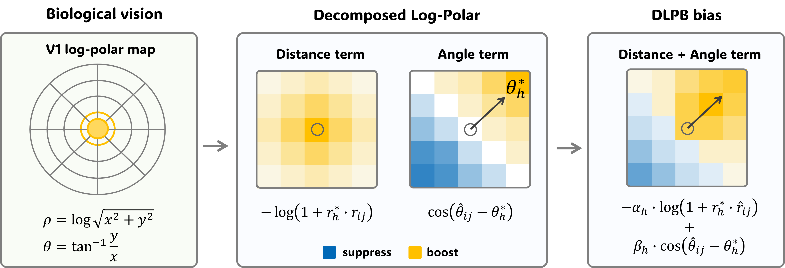

# Decoupled Log-Polar Bias for Vision



> 🌐 日本語版: [`README_jp.md`](README_jp.md) ・ English version: this file


---


## 🧠 Method overview

We inject the **foveated receptive fields** of the biological visual cortex (V1) into the ViT as an attention bias.

### KERPLE-log 2D

$$
B_{ij} = - r_1 \log\left(1 + r_2 \|p_j - p_i\|_2\right)
$$

### Decoupled Log-Polar Bias (DLPB) — adds orientation selectivity

$$
B_{ij}^{(h)} = -r_1^{(h)} \log\left(1 + r_2^{(h)} r_{ij}\right) + s_1^{(h)} \cos(\phi_{ij} - \phi_1^{*(h)})
$$

### DLPB 2nd order — edge selectivity (180° periodic)

$$
B_{ij}^{(h)} = -r_1^{(h)} \log\left(1 + r_2^{(h)} r_{ij}\right) + s_1^{(h)} \cos(\phi_{ij} - \phi_1^{*(h)}) + s_2^{(h)} \cos\left(2(\phi_{ij} - \phi_2^{*(h)})\right)
$$


### DLPB 3rd order — corner selectivity (120° periodic)

$$
B_{ij}^{(h)} = -r_1^{(h)} \log\left(1 + r_2^{(h)} r_{ij}\right) + s_1^{(h)} \cos(\phi_{ij} - \phi_1^{*(h)}) + s_2^{(h)} \cos\left(2(\phi_{ij} - \phi_2^{*(h)})\right) + s_3^{(h)} \cos\left(3(\phi_{ij} - \phi_2^{*(h)})\right)
$$


---


## 📊 Method comparison

| Method | Bias formula | PE params |
|--------|--------------|:---------:|
| APE | $x_i + p_i$ (learned, added to tokens) | 12.3K |
| ALiBi-2D | $B_{ij} = -m\,\lVert p_j - p_i \rVert_2$ | 0 |
| RPB | $B_{ij} = T[\Delta_{ij}]$ (learned table) | 8.1K |
| CPB | $B_{ij} = \mathrm{MLP}(\Delta x_{ij}, \Delta y_{ij})$ | 36.9K |
| RoPE2D (`rope_2d`) | $\langle R_{\theta_i} q_i,\ R_{\theta_j} k_j \rangle$ (Q/K rotation) | 0 |
| KERPLE-log 2D (`kerple_log_2d`) | $B_{ij} = -r_1 \log(1 + r_2 \lVert p_j - p_i \rVert_2)$ | 72 |
| **DLPB Aniso (`dlpb`)** | $B_{ij}^{(h)} = -r_1^{(h)}\log(1+r_2^{(h)} r_{ij}) + s_1^{(h)}\cos(\phi_{ij}-\phi_1^{*(h)})$ | **180** |
| **DLPB VM (`dlpb_O2`)** | $\;\cdots\; + s_2^{(h)}\cos\!\big(2(\phi_{ij}-\phi_2^{*(h)})\big)$ | **252** |
| **DLPB VM3 (`dlpb_O3`)** | $\;\cdots\; + s_3^{(h)}\cos\!\big(3(\phi_{ij}-\phi_2^{*(h)})\big)$ | **324** |
| **DLPB *`_rope_2d`** | DLPB logit bias + RoPE2D Q/K rotation (hybrid) | **same** |

> Bold rows are the proposed methods (`dlpb` / `dlpb_O2` / `dlpb_O3` and their RoPE2D hybrids `_rope_2d`).
> Other explored variants remain registered in `src/models.py` but are excluded from the default comparison list. See the "DLPB" section above.

---

## 📁 File layout

```
LPB-V/
├── README.md                     # English README (this file)
├── README_jp.md                  # Japanese README
├── log_polar_bias_for_vision.md  # research design / theory / experiment plan
├── DLPB_ellipse_anisotropy_summary.md  # DLPB design discussion
├── train.py                      # training script (all datasets; lives at repo root)
├── src/                          # Python sources other than train.py
│   ├── models.py                 # ViT-Tiny + all PE implementations + ResNet18/50
│   ├── eval_resolution.py        # resolution-extrapolation evaluation script
│   ├── summarize_results.py      # result aggregation / README update
│   ├── compare_cpb_dlpb.py       # bias comparison / visualization (CPB vs DLPB)
│   ├── visualize_pe.py           # PE bias visualization
│   ├── visualize_alpha.py        # per-head scale α visualization
│   └── plot_*.py                 # various figure generation
├── scripts/                      # shell scripts
│   ├── run_experiments.sh        # run all CIFAR-100 experiments
│   ├── run_imagenet100.sh / run_cars.sh / run_pets.sh / run_flowers102.sh
│   └── run_rope_2d.sh            # RoPE2D-family experiments
├── plot/                         # output directory for generated figures (.png)
├── data/
│   ├── cifar-100-python/         # CIFAR-100 (auto download)
│   ├── imagenet100/              # ImageNet-100 (manual)
│   │   ├── train/
│   │   └── val/
│   ├── stanford_cars/            # Stanford Cars (manual)
│   └── oxford-iiit-pet/          # Oxford Pets (auto download)
└── results/
    ├── resolution/
    │   └── {dataset}.json        # resolution-extrapolation results
    └── {dataset}/
        └── {pe_type}/
            ├── config.json       # experiment config
            ├── log.log           # per-epoch log
            ├── best.pth          # best model
            └── result.json       # final accuracy
```

> Run scripts from the repository root in principle (`train.py` is at the root, the rest live under `src/`). The relative paths inside `run_*.sh` (`./results`, `./data`, `train.py`) are also relative to the root.
> All generated figures (`.png`) are saved under `plot/`.

---

## ⚙️ Setup

This project uses [uv](https://docs.astral.sh/uv/) for dependency management
(PyTorch 2.6.0+cu124).

```bash
# Create the virtual environment and install dependencies (.venv/)
uv sync

# Sanity check (forward pass of all PEs)
uv run python src/models.py
```

`uv run` automatically uses the project's `.venv`, so there is no environment to
activate manually. Prefix any command with `uv run` (e.g. `uv run python train.py ...`).

---

## 🚀 Running experiments

### Supported datasets

| Dataset | Argument | Image size | Patch | Classes | Acquisition |
|---------|----------|:----------:|:-----:|:-------:|-------------|
| CIFAR-100 | `cifar100` | 32×32 | 4×4 | 100 | auto download |
| ImageNet-100 | `imagenet100` | 224×224 | 16×16 | 100 | manual placement required |
| Flowers-102 | `flowers102` | 224×224 | 16×16 | 102 | auto download |
| Stanford Cars | `cars` | 224×224 | 16×16 | 196 | manual placement required ※ |
| Oxford-IIIT Pets | `pets` | 224×224 | 16×16 | 37 | auto download |

> ※ The official Stanford Cars download link is down, so download it manually (e.g. from Kaggle) and place it under `data/stanford_cars/`.
> Place ImageNet-100 under `data/imagenet100/train/` and `data/imagenet100/val/` in ImageFolder layout.

### Run all CIFAR-100 experiments at once (including ResNet baselines)

```bash
bash scripts/run_experiments.sh
# ~6.5 hours on an RTX 4090 (cuda:1)
```

### Run all Swin V2-Tiny experiments

The same PE set can be compared on a **Swin V2-Tiny** backbone (scaled-cosine
attention, residual-post-norm, hierarchical patch merging). The PE bias is
evaluated on the within-window relative grid; `--pe_type cpb` recovers Swin V2's
native log-spaced continuous position bias.

```bash
bash scripts/run_swinv2.sh cifar100 1 300   # dataset gpu epochs
bash scripts/run_swinv2.sh imagenet100 1 300
```

Swin results are written to `./results/<dataset>/swinv2_t/<pe_type>/` (isolated
from the flat ViT layout). Backbone config per resolution: 32px → patch 2 /
window 4 (grid 16→8→4→2); 224px → patch 4 / window 7 (grid 56→28→14→7); the
window auto-shrinks to the feature size in deep stages.

### Single experiment

```bash
# ViT + PE method
uv run python train.py --dataset cifar100   --pe_type dlpb_O2 --gpu 1 --epochs 300
uv run python train.py --dataset flowers102 --pe_type ape        --gpu 1 --epochs 200

# Swin V2-Tiny + PE method
uv run python train.py --dataset cifar100   --backbone swinv2_t --pe_type dlpb_O2 --gpu 1 --epochs 300
uv run python train.py --dataset imagenet100 --backbone swinv2_t --pe_type cpb     --gpu 1 --epochs 300

# ResNet baseline
uv run python train.py --dataset cifar100   --pe_type resnet18 --gpu 1 --epochs 300
uv run python train.py --dataset imagenet100 --pe_type resnet50 --gpu 1 --epochs 300
```

### Main arguments

| Argument | Default | Description |
|----------|---------|-------------|
| `--dataset` | `cifar100` | `cifar100 / imagenet100 / flowers102 / cars / pets` |
| `--backbone` | `vit_tiny` | `vit_tiny / swinv2_t` (swin is incompatible with `resnet*` baselines) |
| `--pe_type` | `ape` | Proposed: `dlpb / dlpb_O2 / dlpb_O3` (+ `_rope_2d` hybrids)<br>Baselines: `no_pe / ape / alibi_2d / rpb / cpb / rope_2d / kerple_log_2d / resnet18 / resnet50`<br>Explored variants (registered only): `dlpb_aniso / dlpb_vm / dlpb_vm3 / dlpb_ape_vm / *_sc_fix / dlpb_movm*` (+ `_sc`, `_rope_2d`) |
| `--epochs` | `300` | number of training epochs |
| `--batch_size` | `256` | batch size |
| `--lr` | `5e-4` | peak learning rate (cosine decay) |
| `--gpu` | `0` | CUDA device index |
| `--data_dir` | `./data` | dataset root directory |
| `--results_dir` | `./results` | output directory for results |

### Checking results

```bash
uv run python src/summarize_results.py                          # list available datasets
uv run python src/summarize_results.py cifar100                 # show cifar100 (ViT) results
uv run python src/summarize_results.py cifar100 --backbone swinv2_t   # Swin V2-Tiny results
```

### Results — Top-1 accuracy (%) across datasets

ViT-Tiny backbone, trained at each dataset's native resolution (300 epochs; CIFAR-100 at 32px, the rest at 224px).

| PE | CIFAR-100 | ImageNet-100 | Flowers-102 | Cars | Pets |
|----|----------:|-------------:|------------:|-----:|-----:|
| `no_pe` | 63.47 | 74.60 | 40.98 | 12.60 | 26.60 |
| `ape` | 70.38 | 76.74 | 40.29 | 15.78 | 27.56 |
| `alibi_2d` | 66.87 | 76.76 | 41.18 | 13.79 | 27.94 |
| `rpb` | 72.99 | 78.86 | 38.63 | 13.77 | 27.17 |
| `cpb` | **76.61** | 80.84 | **42.45** | **26.43** | 34.70 |
| `rope_2d` | 74.67 | 80.92 | 42.35 | 17.25 | 34.23 |
| `kerple_log_2d` | 69.89 | 78.44 | 40.69 | 14.90 | 29.08 |
| **`dlpb`** | 73.65 | 79.46 | 41.37 | 15.51 | 29.60 |
| **`dlpb_rope_2d`** | 74.26 | **81.30** | 42.06 | 19.65 | 34.07 |
| **`dlpb_O2`** | 74.78 | 80.18 | 39.41 | 16.14 | 30.96 |
| **`dlpb_O2_rope_2d`** | 75.32 | 81.20 | 42.06 | 19.35 | **35.30** |
| **`dlpb_O3`** | 74.30 | 80.24 | 40.49 | 17.42 | 30.53 |
| **`dlpb_O3_rope_2d`** | 74.68 | 81.26 | **42.45** | 17.35 | 34.83 |
| `resnet18` (CNN ref.) | — | 82.40 | 57.75 | 74.39 | 70.35 |

> Bold rows are the proposed methods; **bold values** mark the best PE per dataset. `resnet18` is a CNN reference (not a PE method) and is excluded from the per-column best. Regenerate with `uv run python src/summarize_results.py <dataset>`.

### Resolution-extrapolation evaluation

Test at resolutions different from training and compare the resolution generalization of each PE type.

```bash
uv run python src/eval_resolution.py              # list available datasets
uv run python src/eval_resolution.py cifar100     # evaluate cifar100
uv run python src/eval_resolution.py flowers102   # evaluate flowers102
```

The evaluated PE types use the same list as `summarize_results.py` (8 baselines + 6 proposed methods). Individual selection is also possible via `--pe_types`.
Results are saved to `./results/resolution/{dataset}.json`.

Main arguments:

| Argument | Default | Description |
|----------|---------|-------------|
| `dataset` | (auto-detected) | dataset name to evaluate |
| `--results_dir` | `./results` | where to search for checkpoints |
| `--data_dir` | `./data` | dataset root directory |
| `--gpu` | `0` | CUDA device index |
| `--batch_size` | `128` | batch size |

#### Test resolutions

| Dataset | Training resolution | Test resolutions |
|---------|:-------------------:|------------------|
| cifar100 | **32px** | 16, 24, **32**, 40, 48, 56, 64 |
| flowers102 / cars / pets | **224px** | 96, 128, 160, 192, **224**, 256, 320, 384 |

#### Resolution-adaptation scheme per PE type

| PE type | Adaptation scheme |
|---------|-------------------|
| `no_pe` | unchanged (no positional information) |
| `ape` | bilinearly interpolate pos_embed (2D reshape → interp → flatten) |
| `alibi_2d` | recompute the dist buffer on the new grid (slopes unchanged) |
| `rpb` | bilinearly interpolate the bias table, rebuild idx |
| `cpb` | recompute rel_coords on the new grid |
| `dlpb_*` | recompute dist / angle buffers (reuse $r_1, r_2, \phi^*, s$) |

> Because DLPB expresses distance decay with functional parameters ($r_1, r_2$, etc.), it generalizes to arbitrary resolutions by buffer recomputation alone.

> Full per-resolution results are saved to `results/resolution/{dataset}.json`.

---


---

## 📚 References

- Chi et al. (2022). **KERPLE**: Kernelized Relative Positional Embedding for Length Extrapolation. *NeurIPS 2022*
- Press et al. (2022). **ALiBi**: Train Short, Test Long: Attention with Linear Biases. *ICLR 2022*
- Heo et al. (2024). Rotary Position Embedding for Vision Transformer. *ECCV 2024*
- Liu et al. (2022). **Swin Transformer V2**: Scaling Up Capacity and Resolution. *CVPR 2022*
- Touvron et al. (2021). **DeiT**: Training data-efficient image transformers. *ICML 2021*
- Fisher (1953). **von Mises distribution**: Dispersion on a Sphere. *Proc. Royal Society A*
  (theoretical background for the von Mises angular terms in `dlpb_O2` / `dlpb_O3`)
